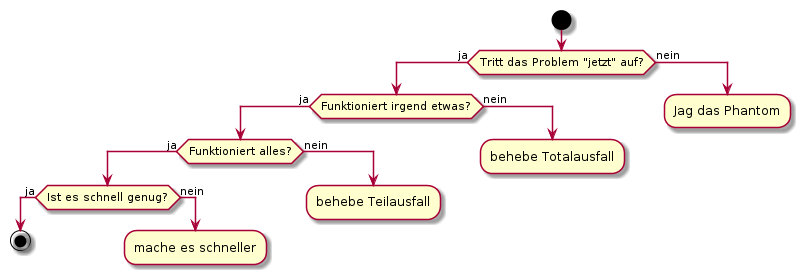
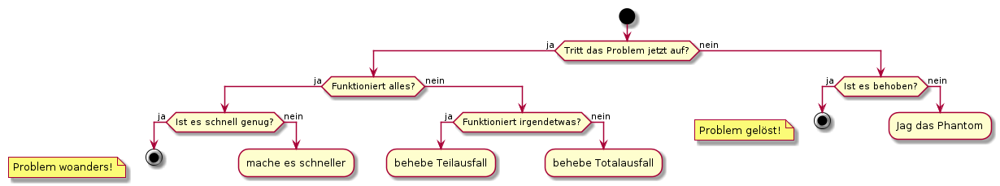

Fragen
======

Die besten Erfolgsaussichten bei einer Fehlersuche habe ich, wenn ich
mit den richtigen Fragen anfange. Darum beginne ich immer mit den selben
Fragen, die ich - je nach Problemfeld - anpasse.

1. Tritt das Problem "jetzt" auf?
2. Funktioniert irgendetwas?
3. Funktioniert alles?
4. Ist es schnell genug?

   Entscheidungsbaum

Dabei gehe ich üblicherweise erst zur nächsten Frage über, wenn ich die
vorherige mit *Ja* beantworten kann. Das ist besonders wichtig für die
erste Frage, die ich nie auslasse. Muss ich eine Frage mit *Nein*
beantworten und arbeite zunächst das entsprechende Teilprogramm ab,
fange ich anschließend wieder oben an.

Der Hauptzweck der zweiten Frage ist, einen Totalausfall von einem
Teilausfall zu unterscheiden. Die dritte Frage erinnert mich,
systematisch alle Aspekte des Problems zu bedenken und die vierte Frage
schließlich geht auf nicht funktionale Anforderungen ein.

Der oben gezeigte Entscheidungsbaum ist dabei einfacher zu merken, als
der folgende optimierte Entscheidungsbaum der zum gleichen Ergebnis
führt.

   Optimierter Entscheidungsbaum

Auch hier fange ich wieder oben an, nachdem ich ein Teilprogramm
abgearbeitet habe. Ich unterscheide allerdings zwei Ausgänge, je nachdem
ob das Problem nicht mehr auftritt, weil es behoben ist, oder ob das
Problem zwar vorhanden ist, aber nicht in meiner Verantwortung liegt.

Da ich nicht alle Probleme selbst lösen kann, steht immer eine fünfte
Frage implizit im Hintergrund:

-  Wann sollte ich eskalieren?

Ich eskaliere ein Problem, indem ich Hilfe von anderen suche, weil ich
selbst bei diesem Problem nicht mehr weiter weiß. Ehrlich gesagt, stelle
ich mir diese Frage oft zu spät, weil ich zuerst versuche, meine
Probleme selbst zu lösen. Manche hingegen beantworten diese Frage zu
früh mit *Ja*, weil sie nicht alle Möglichkeiten ausschöpfen, die ihnen
zur Verfügung stehen. Ziel der Artikelreihe ist, diese Möglichkeiten
bewusst zu machen und den optimalen Zeitpunkt für eine Eskalation zu
finden.

Die einfache Antwort lautet, wenn ich eine Frage selbst nicht
beantworten kann. Oder, wenn die Antworten auf meine Fragen scheinbar
keinen Sinn ergeben.

Dabei sollte ich versuchen, das Ergebnis der Eskalation als Mittel zum
Lernen anzusehen und meinem Erfahrungsschatz hinzuzufügen.

Tritt das Problem "jetzt" auf?
------------------------------

Das Wort "jetzt" steht in Anführungsstrichen, weil ich es hier in
verschiedene Bedeutungen verwende.

Am Anfang der Untersuchung geht es darum, dass ich das Problem
wahrnehme, wenn es auftritt. Dabei kann dieses "jetzt" auch ein
Zeitpunkt in der Vergangenheit sein, wenn ich genügend Informationen für
diesen Zeitpunkt habe, um das Problem zu erkennen. Meist geht es jedoch
um die Gegenwart.

Die zweite Bedeutung dieses "jetzt" geht nicht nach dem exakten
Zeitpunkt sondern den Umständen, unter denen das Problem auftritt.
Generell ist eine Fehlersuche einfacher, wenn ich das Problem
willkürlich hervorrufen kann, indem ich die dafür nötigen Umstände
herbeiführe. Dann bedeutet "jetzt": unter diesen Umständen. Das brauche
ich, um am Ende zeigen zu können, dass das Problem behoben ist.

Die Antworten auf diese Frage bekomme ich mitunter aus der
entsprechenden Problemmeldung oder dem Ticket, manchmal auch aus den
Logs oder einem Paketmitschnitt.
Oft muss ich nachfragen, via E-Mail, Rückfrage im Ticket, Anruf oder
persönlichem Gespräch.
Welcher Weg am besten passt ist von Fall zu Fall verschieden.
Wichtig ist, dass ich das Problem erkenne und idealerweise zu
Testzwecken selbst hervorrufen kann.

Ich habe schon Problemmeldungen geschlossen, weil da kein Problem war,
als ich nachschaute. Und ich bin `nicht der
einzige <https://xkcd.com/583/>`__. Die beste `Fehlersuche geht ins
Leere <https://dzone.com/articles/if-you-cant-reproduce-bug-you>`__,
wenn das Problem aktuell gar nicht besteht.

Bei Iterationen im Entscheidungsbaum, wenn ich zum wiederholten Mal oben
anfange, kann es sein, dass ich mit meinen Aktionen das Problem
beseitigt habe. Dann ist diese Frage Abbruchbedingung.

Wenn ich nicht am Anfang die Chance hatte, das Problem zu beobachten,
während es auftrat, habe ich keinen Vergleich, zwischen dem Zustand mit
Problem und dem ohne und kann daher selten sicher sein, es wirklich
gelöst zu haben, selbst wenn ich es - zufällig - mit meinen Aktionen
beseitige.

Tritt das Problem nur hin und wieder auf, hilft mir die Frage nach dem
zeitlichen Ablauf, Korrelationen mit den Systemprotokollen herzustellen
und zwischen sporadischen und periodischen Problemen zu unterscheiden.

Funktioniert irgendetwas?
-------------------------

Diese Frage gibt mir Hinweise, was ich bei der Fehlersuche zunächst
ignorieren kann, und worauf ich mein Hauptaugenmerk richte. Dabei ist
dieses irgendetwas nicht zufällig aus dem Lostopf gezogen, sondern
zielgerichtet ausgewählt, um den Fehler möglichst schnell einzugrenzen.

Ein VPN ist, wie der Name schon sagt, ein Netzwerk und dass dieses
funktioniert kann ich implizit schließen, wenn mir eine Verbindung
angezeigt wird. Konkret frage ich als darum erstes:

-  Gibt es ISAKMP und IPsec Security Associations?

Ganz sicher kann ich sein, wenn mir nicht nur die Security Associations
(SA) angezeigt werden, sondern auch Traffic in beiden Richtungen.

Die Antwort darauf kann ich bei den meisten VPN-Gateways sehr einfach
bekommen und bei einer positiven Antwort erspare ich mir sehr viele
Untersuchungen. Außerdem sehe ich oft, ob Daten gesendet werden und kann
die Fehlersuche entsprechend ausrichten.

Sehe ich hingegen keine ISAKMP bzw. IPsec SA, muss ich mir Gedanken
machen, ob überhaupt Traffic ankommt, für den die SA konfiguriert
wurden. Hierzu ist es hilfreich, zu wissen, ob der Datenverkehr von
meiner Seite des Netzes ausgeht, oder von der Seite des Peers.

Im ersten Fall schaue ich nach, ob unverschlüsselter Traffic am VPN
Gateway ankommt, der an das Netz des Peers gerichtet ist, im zweiten
Fall, ob IKE-Traffic auf der externen Seite meines VPN-Gateways ankommt.
Das heißt, ich suche nach Datenverkehr, der den Aufbau eines VPN-Tunnels
auslöst. Gibt es diesen Datenverkehr nicht, muss ich nicht nach einem
Fehler in meinem VPN-Gateway zu suchen.

Diese Überlegungen gelten jedoch nur für On-Demand-VPN, die nur
aufgebaut werden, wenn Traffic dafür ankommt und nach einer gewissen
Zeit ohne Datenverkehr abgebaut werden. Bei ständig aufgebauten - zum
Beispiel route-based - VPN müssen die zugehörigen SA immer zu sehen
sein, auch wenn kein Traffic für den Tunnel da ist.

Sehe ich ankommenden unverschlüsselten Datenverkehr von innen oder
IKE-Daten von außen, muss ich untersuchen, warum der Tunnel nicht
aufgebaut wird.

Kommt der Traffic von meiner Seite, frage ich, ob mein VPN-Gateway
zumindest versucht, einen Tunnel aufzubauen und welche Antworten es vom
Peer bekommt.

Kommt der Traffic vom Peer, schaue ich mir die Parameter an, mit denen
sein VPN-Gateway versucht, den Tunnel aufzubauen und vergleiche sie mit
meiner Konfiguration.

Ich frage dabei immer detaillierter nach, bis ich zum Kern des Problems
komme. Dabei behebe ich entdeckte Fehler bis ich schließlich Daten mit
mindestens einer IPsec SA verschlüsselt übertragen kann. Erst dann kann
ich zur nächsten grundlegenden Frage übergehen.

Funktioniert alles?
-------------------

Habe ich zumindest einen Tunnel mit IPsec SA, kann ich davon ausgehen,
dass das VPN grundsätzlich funktioniert. Auch dann bleiben noch genügend
Fragen.

-  Gibt es eingehenden und ausgehenden Traffic?

Ein aufgebauter VPN-Tunnel nützt nur dann etwas, wenn er Traffic in
beiden Richtungen überträgt. Fehlt eine Richtung, frage ich zunächst, ob
der fragliche Traffic überhaupt bei meinem VPN-Gateway ankommt. Kommt
dieser Traffic nicht an, brauche ich zunächst nichts weiter zu machen
und kann die Suche wieder delegieren. Kommt er am VPN-Gateway an, muss
ich untersuchen, warum der Traffic nicht auf der anderen Seite
hinausgeht.

Gehen keine weiteren IPsec SA nach dem ersten auf, vergleiche ich die
ACL und IPsec Krypto Parameter.

Finde ich keine Erklärung, ist das ein guter Zeitpunkt zu eskalieren und
mir Hilfe zu holen.

-  Gibt es Traffic für alle konfigurierten IPsec SA in beiden
   Richtungen?

Diese Frage ist etwas schwierig zu beantworten, weil der Traffic
üblicherweise von anderen erzeugt wird und hier ein Koordinationsproblem
entstehen kann. Nichtsdestotrotz sollte diese Frage spätestens bei der
Abnahme des VPN mit *Ja* beantwortet sein.

-  Gibt es Fehlermeldungen oder Warnungen in den Logs?

Auch wenn das VPN scheinbar vollständig funktioniert, kann ein Blick in
die Logs auf bisher unentdeckte Probleme hinweisen. Natürlich setzt das
einen zeitnahen Zugriff auf die Systemprotokolle voraus.

Ist es schnell genug?
---------------------

Die Frage nach der Geschwindigkeit ist nicht leicht zu beantworten. Im
Idealfall habe ich eine Baseline und damit ein einigermaßen objektives
Kriterium für die Geschwindigkeit des VPN.

Zwei Faktoren beeinflussen die Geschwindigkeit in einem Netz und damit
auch im VPN wesentlich:

-  der Durchsatz beziehungsweise die maximale Datenmenge pro
   Zeiteinheit, die durch das Netz gehen - diesen will ich möglichst
   groß - und
-  die Latenz beziehungsweise die Zeit zum Übertragen eines einzelnen
   Datagramms - diese will ich möglichst klein haben.

Beide Faktoren beeinflussen sich gegenseitig und sind im laufenden
Betrieb nicht einfach zu messen. Manchmal ist es möglich, über die
Laufzeit - ein Maß für die Latenz - auf den maximalen Durchsatz zu
schließen.

Da dabei aber fremdbestimmte Netzkomponenten beteiligt sind, muss ich
diese Erkenntnisse immer mit Vorsicht verwenden. Das beste, was ich in
den meisten Fällen tun kann, ist Durchsatz und Latenz an meinem Gateway
optimal einzustellen und versuchen ungefähr zu ermitteln, an welcher
Stelle im Netz die Verbindung verlangsamt wird. Finde ich als Ursache
das VPN-Gateway, muss ich über leistungsfähigere Hardware nachdenken.

-  Wie sieht die Round-Trip-Zeit der entschlüsselten Daten aus?

Das ist eine der Fragen zur Geschwindigkeit eines VPN, die sich relativ
einfach beantworten lässt. Allerdings geht in die Round-Trip-Zeit neben
der Zeit für die Ver- und Entschlüsselung noch die Zeit für die
Übertragung im Netz und die Antwortzeit der Gegenstelle ein, so dass bei
einer zu langen Round-Trip-Zeit die Ursache nicht auf Anhieb genau
benannt werden kann. Durch Vergleichsmessungen der Paketlaufzeit
zwischen den beiden VPN-Gateways lassen sich zumindest Teile der
Störgrößen herausrechnen. Durch genaues Betrachten der Zeitstempel der
Datagramme lässt sich vielleicht ermitteln, ob das Problem eher auf der
verschlüsselten oder auf der entschlüsselten Seite liegt.

-  Wie groß ist die Verzögerung durch Ver- und Entschlüsselung?

Leider lässt sich diese Frage nur beantworten, wenn das VPN selbst nur
wenig benutzt wird, da ich hier die verschlüsselten Datagramme auf der
Außenseite den unverschlüsselten auf der Innenseite zuordnen muss. Dann
kann die Zeit, die für die Verschlüsselung benötigt wird, einen Hinweis
geben, ob vielleicht ein leistungsfähigeres VPN-Gateway oder Maßnahmen
zu dessen Entlastung angebracht sind.

-  Wie groß ist der Durchsatz des VPN-Gateways?

Hierzu kann ich den gesamten verschlüsselten Datenverkehr pro
Zeiteinheit betrachten und vergleichen, ob ich mich einem - vorher
ermittelten - Maximalwert nähere.

