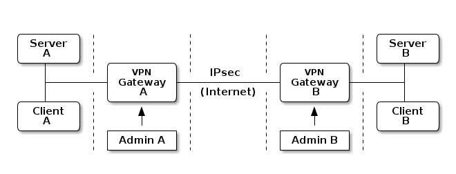

Problemstellung
===============

Ein VPN zu betreiben und Fehler dabei zu suchen ist schon nicht einfach,
wenn man beide Endpunkte selbst betreibt.
Doch dann hat man die meisten Komponenten unter Kontrolle und kann in
Ruhe alles testen.

Noch etwas schwieriger wird es, wenn man ein half-managed VPN betreibt
bei dem jeder Administrator nur sein VPN-Gateway kontrollieren kann.
Kommen dazu noch Geräte oder Software unterschiedlicher Hersteller auf
beiden Seiten in's Spiel, kann es schon etwas vertrackt werden, einem
Problem auf die Schliche zu kommen.

   Half-Managed VPN

Das Diagramm soll die möglichen Problemfelder verdeutlichen:

* An zentraler Stelle ist IPsec als Protokoll selbst.
  Im Gegensatz zu OpenVPN, bei dem beide Seiten Software aus der gleichen
  Quelle verwenden, was Interoperabilitätsprobleme sehr stark reduziert,
  handelt es sich bei IPsec um ein durch RFCs definiertes und standardisiertes
  Protokoll, das von verschiedenen Herstellern auf je eigene Weise
  interpretiert wird.

* Die verschiedenen Hersteller implementieren verschiedene Features des
  Protokolls, über die ich eine Schnittmenge bilden muss, zwischen den
  Fähigkeiten der beteiligten Geräte und den Anforderungen an die Verbindung.

* Manchmal verwenden die Hersteller gleiche Begriffe für unterschiedliche
  Dinge und unterschiedliche Begriffe für die gleichen Dinge.
  Beides trägt keineswegs dazu bei, die Verständigung zwischen den
  Administratoren der beiden Seiten zu erleichtern.
  Dabei ist gerade eine gute Kommunikation notwendig, denn im schlimmsten Fall
  sieht jeder Administrator nur sein VPN-Gateway, was im Diagramm durch die
  Strichlinien angedeutet ist.

* Das nächste Problem ist NAT, die Manipulation von IP-Adressen.
  NAT führt dazu, dass sich die Adressen ein und desselben Datagrams im Netz A
  von den im Tunnel verwendeten und diese von den im Netz B unterscheiden
  können.
  Solange alles funktioniert, mag das angehen, im Fehlerfall kann es die
  Verwirrung vergrößern.

* Gerade bei L2L-VPN kommen im Fehlerfall Koordinationsprobleme hinzu.
  Während es bei den meisten VPN-Gateways eine Möglichkeit gibt, Traffic
  nachzuweisen und zu dokumentieren, muss ich für vollständige Tests
  geeigneten Traffic erzeugen, wofür ich auf die Mitarbeit der Nutzer des VPN
  angewiesen bin.
  Dazu muss ich mich mit allen Beteiligten absprechen, was das Finden eines
  passenden Termins erschweren kann.

